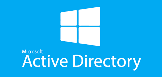

# 🖥️ Projet Active Directory – Entreprise fictive GIFT.SA

---

## 🏢 Contexte du projet

Ce projet a été réalisé dans le cadre de la mise en place d’une **infrastructure Active Directory complète** pour une entreprise fictive nommée **GIFT.SA**.  
L’objectif principal est de **centraliser la gestion des utilisateurs, des ressources et des stratégies de sécurité** afin de renforcer la fiabilité du système d’information et de simplifier l’administration du parc informatique.

  

---

## 🎯 Objectifs

- Mettre en place une **infrastructure Active Directory** fonctionnelle et sécurisée.  
- Déployer un **contrôleur de domaine principal (DC)** et un **contrôleur de domaine en lecture seule (RODC)** sur un site distant (Bordeaux).  
- Créer une **arborescence d’annuaire** adaptée à la structure de l’entreprise.  
- Mettre en œuvre des **stratégies de sécurité (GPO)** pour protéger les postes et les comptes.  
- Configurer la **réplication inter-sites** et fiabiliser l’architecture réseau.

---

## 📘 SOMMAIRE

### I – Préparation de l’environnement
- Préparation des serveurs  
- Configuration du premier contrôleur de domaine  
- Configuration du second contrôleur de domaine  
- Mise en place de l’arborescence Active Directory  
- Déclaration des ressources  
- Création des premiers objets  
- Intégration des postes clients au domaine  
- Mise en place d’une politique de mot de passe affinée  
- Vérification du fonctionnement de la politique de mot de passe affinée  

---

### II – Analyse de la sécurité de l’architecture
- Utilisation de l’outil d’analyse des bonnes pratiques Microsoft (BPA)  
- Fiabilisation de l’architecture locale  
- Organisation des différents sites géographiques  
- Mise en place d’un contrôleur de domaine en lecture seule (RODC)  

---

### III – Sécurisation du parc informatique grâce à Active Directory
- **Audit et restriction des accès entrants**  
  - Restriction des options de connexion (accès réseau)  
  - Configuration de la restriction d’accès  
  - Attribution des droits  
  - Déploiement de la stratégie de groupe  
- **Restriction de l’exécution des logiciels non autorisés**  

---

### IV – Sauvegarde de la base de données Active Directory

---

## 🔐 Mesures de sécurité mises en place

- **Filtrage des flux réseau** pour limiter les accès non autorisés.  
- **Déploiement centralisé des logiciels et des mises à jour** via les GPO et WSUS.  
- **Restriction de l’exécution des applications non autorisées** pour éviter les infections.  
- **Politique de mot de passe affinée** pour renforcer l’authentification.  
- **Journalisation et audit** des événements critiques.  

---

## 🧱 Architecture Active Directory

- **SRVAD1 (Siège principal)** : Contrôleur de domaine principal (PDC Emulator).  
- **SRVAD2 (Bordeaux)** : Contrôleur de domaine en lecture seule (RODC).  
- **Deux sites configurés** dans *Sites et Services Active Directory* avec un **calendrier de réplication planifié**.  

---

## 🧠 Technologies et outils utilisés

- **Windows Server 2019 / 2022**  
- **Active Directory Domain Services (AD DS)**  
- **Group Policy Management (GPO)**   
- **PowerShell**  
- **Hyper-V / VMware Workstation**  

---

## 📈 Résultats et bénéfices

- Une **infrastructure fiable, sécurisée et centralisée**.  
- Un **contrôle renforcé** des accès et des ressources.  
- Des **mises à jour automatisées** et une administration simplifiée.  
- Une **protection accrue** contre les attaques et les mauvaises manipulations.  

---

## 👤 Auteur

** Serigne Amdy CISSE**  
📧 *sakorfall@outlook.com*  
💻 [Profil GitHub](https://github.com/SerigneAmdyCISSE)

---

## 📄 Licence

Projet publié sous **licence MIT**.  
Tu peux librement le consulter, le modifier et le réutiliser à des fins pédagogiques.
